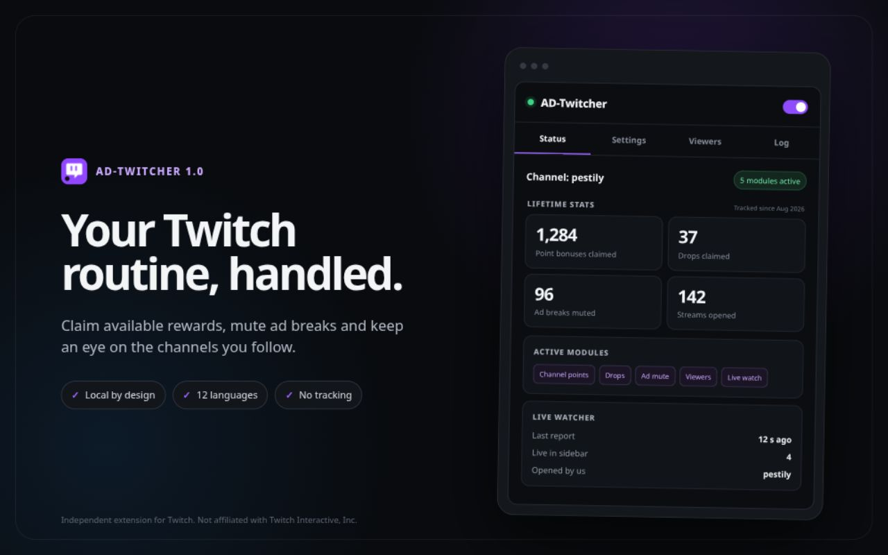
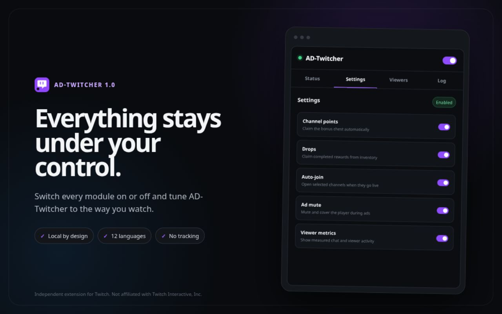
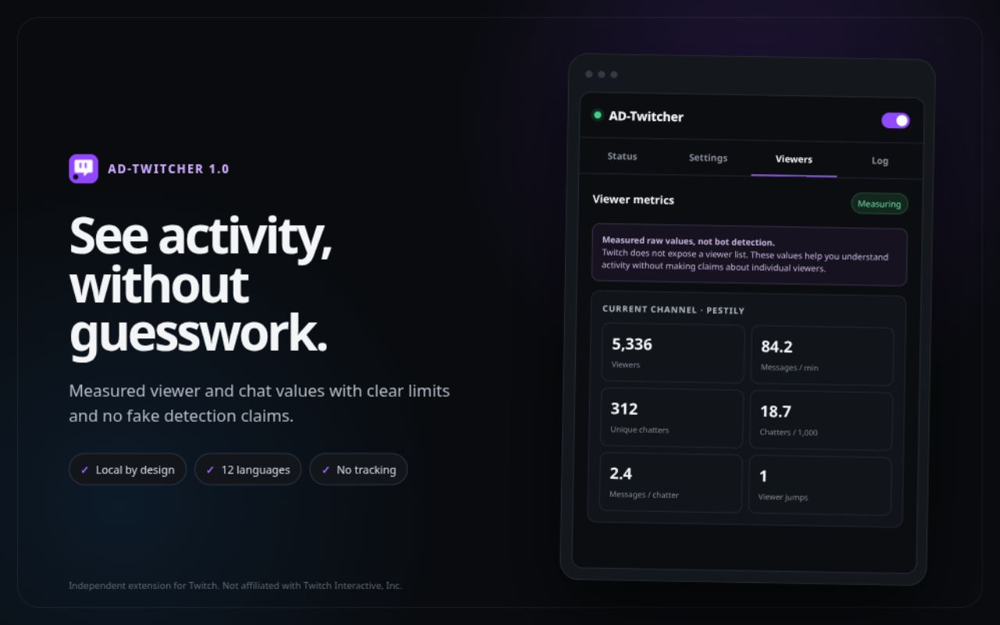

# AD-Twitcher

Twitch browser extension. Chrome and Opera GX MV3 plus Firefox MV2 from a
single codebase.
Plain JavaScript, no bundler, no runtime dependencies.

## Preview



<details>
<summary>More screenshots</summary>





</details>

Store-ready artwork and listing material are available in
[`store/assets`](store/assets) and [`store`](store).

Available in 12 languages: English, German, Spanish, French, Italian,
Portuguese (Brazil), Polish, Russian, Turkish, Japanese, Korean and Simplified
Chinese. The UI follows the browser language; the DOM matchers follow Twitch's
UI language, which is why claim buttons and sidebar controls are matched against
all twelve caption sets rather than English only.

## Modules

| Module | What it does | Runs on |
|---|---|---|
| `watchHealth` | Detects stalled playback, resumes an unrequested pause, protects the tab and sends a local alert | Channel pages |
| `channelPoints` | Clicks the bonus chest | Channel pages |
| `drops` | Claims finished drops (inventory, reloading a stale view first) and reads the unlock notification | Everywhere |
| `adMute` | Detects ads, mutes the browser tab, covers the player with an overlay | Channel pages |
| `viewerStats` | Measures viewer and chat raw values | Channel pages |
| `sidebarWatch` | Reports live status from the followed-channels sidebar | Everywhere |

The background half opens and closes tabs for auto-join, runs the periodic drops
check and owns the counters.

**Telling "working" from "dead".** Lifetime counters only move when something is
actually claimed, so between two drops they prove nothing. The status tab
therefore has an activity card: which channel is being watched and for how long,
when the last drops check ran and what came of it, when the next one is due, and
what was claimed last. Every check writes its outcome to `storage.local` -
including the ones that found nothing, were switched off or failed - so the card
stays honest after the service worker has been terminated and restarted.

## Build and install

```bash
node build.mjs              # dist/chrome, dist/firefox and dist/opera
node build.mjs chrome       # one target only
node build.mjs opera        # Opera GX only
node build.mjs --zip        # plus zip archives in dist/
npm test                    # syntax, manifests, logic and locale checks
```

**Chrome, Edge, Brave:** `chrome://extensions`, enable developer mode, "Load
unpacked", pick `dist/chrome`.

**Firefox:** `about:debugging#/runtime/this-firefox`, "Load Temporary Add-on",
pick `dist/firefox/manifest.json`. Temporary add-ons do not survive a restart.
Permanent installation requires signing (`web-ext sign`) or Firefox Developer
Edition with `xpinstall.signatures.required=false`.

**Opera GX:** open `opera:extensions`, enable developer mode, click "Load
unpacked", and pick `dist/opera`. The Opera GX build is a dedicated package
that uses the same Manifest V3 code and permissions as Chrome.

## What works, and what cannot

**Drops are claimed, not farmed.**
Twitch counts drop progress server-side from the running player's heartbeats.
Nothing accumulates without an open stream. The watchdog can detect stopped
playback, resume a player that paused on its own, protect the tab from
automatic discarding and attempt one recovery reload, but Twitch still decides
whether viewing progress counts. The extension collects finished drops after
Twitch marks them complete.

**The inventory page has to be reloaded, not rescanned.**
Twitch renders `/drops/inventory` once, from data it fetched while the page was
loading, and never refetches it. A tab that has been sitting open therefore
shows the drop state of its load time: a drop that finished afterwards has no
claim button anywhere in that DOM. That is why claiming used to need a manual
F5. When an unlock is reported and the open inventory has nothing to claim, the
background reloads that tab once, waits for it to come back and claims then. A
parked inventory tab also refreshes itself once its view passes 15 minutes, but
only while it is hidden, so nothing reloads under a reader.

**`adMute` is not an ad blocker.**
Twitch uses server-side ad insertion: the ad is muxed into the same HLS stream
as the content. No request exists that could be blocked without blocking the
stream itself. The only working workaround is a proxy that fetches playlists
from an ad-free region (TTV LOL PRO); that needs its own infrastructure, breaks
on every Twitch update, and cuts streamer payouts. What happens here instead:
detect the ad marker, mute, cover, restore exactly on the way out. The ads keep
running, you just do not notice them.

The mute happens on the browser tab by default, not on the `<video>` element.
Writing `muted = true` into the player is visible to Twitch: it lands in the
player's own store and fires `volumechange`, and a restore that does not land
leaves the stream silent for the rest of the session. A tab mute happens
outside the page, so the player never learns about it and the heartbeats that
carry watch time and drop progress are untouched. A tab that was already muted
by hand is left exactly as it is, and never unmuted afterwards. The target is
switchable in the popup (`Mute via`: browser tab, Twitch player, or not at all).

**`viewerStats` does not detect bots.**
Twitch publishes an aggregate number and no viewer list. Whether a viewer is
real cannot be determined from the outside, by anyone, with any method. Only raw
values are measured:

- viewer count
- messages per minute
- unique chatters in the window
- chatters per 1000 viewers
- jumps in the viewer curve (above 30 % within 90 s)

As a rough field baseline, 5 to 30 active chatters per 1000 viewers is typical
for gaming channels. Well below that *can* indicate botting, but just as easily a
passive category (music, chess, watch party), a follower-only chat, or a quiet
stretch. A raid looks exactly like bought viewers. The UI deliberately passes no
judgment.

**Auto-join depends on the sidebar.**
Without OAuth there is no clean live API. Requirements: at least one open,
logged-in Twitch tab, and you have to follow the channel. If that is not enough,
the next step is Twitch Helix with your own client ID.

## Popup says "no content script"

Browsers inject content scripts on navigation only, so tabs that were already
open when the extension was installed or reloaded stay empty. The background
catches up at startup (`injectIntoOpenTabs`), and if that fails the popup shows
an orange "Inject scripts into open tabs" button. If that does not help either,
reload the Twitch tab with F5.

The popup distinguishes three states on purpose:

- *No Twitch tab open* - there really is none
- *Twitch tab found, but no content script* - injection is missing, see above
- *Channel: xy* plus module chips - everything is running

It searches every window, not just the active tab.

## Internationalization

Message catalogs live in `src/_locales/<locale>/messages.json` and are addressed
through `ADT.msg(key, substitutions)` in JavaScript and `data-i18n` attributes in
`popup.html`. `scripts/check.mjs` fails the build when a locale is missing a key,
carries an unknown one, leaves a message empty, mismatches placeholders,
references a key that does not exist, or defines one that nothing uses.

Numbers are formatted with `ADT.formatNumber`, which follows
`i18n.getUILanguage()`. No locale is hardcoded anywhere in the source.

Adding a language means adding one folder under `src/_locales`, and extending
three caption tables so the DOM matchers keep working:

- `CLAIM_TEXTS` in `content/modules/drops.js`
- `SHOW_MORE_TEXTS` in `content/modules/sidebar-watch.js`
- `DANGER_RX` in `lib/dom.js`

`DANGER_RX` is the money blocklist. Getting it wrong in a new language means the
click guard stops recognizing paid actions in that language, so it is the one
table that must not be skipped.

## Known fragile points

Everything runs on DOM selectors. Twitch renames generated class names
regularly, and a module then reaches into empty space. Every selector therefore
carries fallbacks, and wherever possible matching goes through
`data-a-target` / `data-test-selector` or visible button text rather than
generated class names. When something stops working: set the log level to
`debug` in the popup, open the Log tab, then extend the affected selector list in
the module.

Chrome can terminate the MV3 service worker at any time. All runtime state lives
in `storage.local`, never in module variables.

## Layout

```
src/
  manifest.chrome.json     MV3
  manifest.firefox.json    MV2
  manifest.opera.json      MV3 (kept identical to Chrome by checks)
  _locales/                12 message catalogs
  lib/        browser.js (API shim, i18n) · storage.js (settings, write queue)
              log.js · dom.js (helpers, click guard)
  content/    index.js (orchestrator) · beacon.js (diagnostics) · modules/
              overlay.css
  background/ sw.js (entry point, alarms, router) · live-watch.js
  popup/      popup.html/css/js
scripts/      check.mjs (static checks) · smoke.mjs (logic tests)
build.mjs
```

`content/index.js` decides from route plus settings which modules run and
rebinds them on SPA navigation, because Twitch remounts chat and player
completely on a channel switch.

## Safety model

Twitch mixes free and paid actions inside the same UI, so a selector that is one
step too broad buys Power-ups with Bits. Three guards apply to every click, and
`lib/dom.js` exposes `safeClick` as the only click path:

1. **Money blocklist** - labels matching paid wording in any of the 12 languages
   are never clicked, whatever selector produced them.
2. **Dialog guard** - nothing inside a modal is ever clicked.
3. **Click budget** - 10 clicks per minute, globally. Exceeding it halts
   automation and logs which module consumed the budget, on what.

`scripts/check.mjs` enforces that no module bypasses `safeClick`, that
`humanClick` stays private, and that the drops module has no click path outside
`/drops/inventory`.

## Legal

Automated clicking sits in a grey area of Twitch's terms of service. Channel
point and drop claiming is widespread and tolerated in practice, which is not a
guarantee. Use at your own risk.

## License

Apache 2.0. See [LICENSE](LICENSE).

## Author

Created and maintained by [@zCrxticxl](https://x.com/zCrxticxl).

If the extension is useful to you, you can [buy me a coffee](https://buymeacoffee.com/zcrxticxl).
